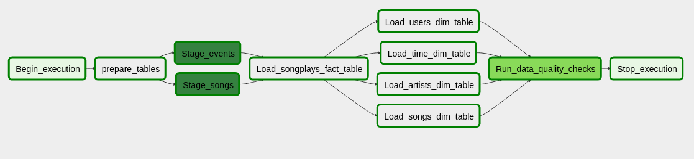

# Sparkify's  Data Pipeline

  

## Plot

A music streaming company, Sparkify, has decided that it is time to introduce more automation and monitoring to their data warehouse ETL pipelines and come to the conclusion that the best tool to achieve this is Apache Airflow.

They have decided to bring you into the project and expect you to create high grade data pipelines that are dynamic and built from reusable tasks, can be monitored, and allow easy backfills. They have also noted that the data quality plays a big part when analyses are executed on top the data warehouse and want to run tests against their datasets after the ETL steps have been executed to catch any discrepancies in the datasets.

The source data resides in S3 and needs to be processed in Sparkify's data warehouse in Amazon Redshift. The source datasets consist of JSON logs that tell about user activity in the application and JSON metadata about the songs the users listen to.
  

## How to run
1. Install airflow
```console
$ pip install airflow 
$ airflow initdb
```
2. Create a IAM Role on AWS with permission to read from S3
3. Create a Redshift cluster, giving the IAM role created to it
2. Run airflow web UI:
```console
$ airflow webserver
```
4. Create the variable `redshift_s3_role` with the IAM role ARN as the value on the UI.
5. Create a connection called `redshift_conn` on the UI with the redshift database credentials
6. Copy the project files to `AIRFLOW_HOME`(eg. `~/airflow`)
7. Start the scheduler:
```console
$ airflow scheduler
```
8. Use the UI to enable the `songplays_S3_to_DWH`dag


### Datasets
* Log data: ```s3://udacity-dend/log_data```
* Song data: ```s3://udacity-dend/song_data```
### Pipeline



Tasks:

* prepare_tables: clean staging tables and create staging/dimension/fact tables if have to
* Stage_events: copies the log data files relative to the execution date to the table `staging_events`
* Stage_songs: copies the song data files to the table `staging_songs`
* Load_songplays_fact_table: adds the data related with music playing from `staging_events` to `songplays` table
* Load_users_dim_table: adds the data related to the fact from `staging_events` to `users` table
* Load_songs_dim_table: Replaces the data from `songs` with the ones in `staging_songs`
* Load_artists_dim_table: Replaces the data from `artists` with the ones in `staging_songs`
* Load_time_dim_table: adds the data related to the fact from `staging_events` to `users` table
* Run_data_quality_checks: Validates if the data in the tables are correct (only checks if the tables aren't empty right now)

### Operators

#### StageToRedshiftOperator

With a redshift connection and S3 templatable path, copies the data from S3 to a staging table. It uses IAM roles 
delegation to read from s3.


#### DataQualityOperator
Executes a list of sql queries against a redshift connection and test the result with the ones expected by the user.

### LoadTableToTableOperator
Given a sql, loads the data from one table to another. Optional truncate first.